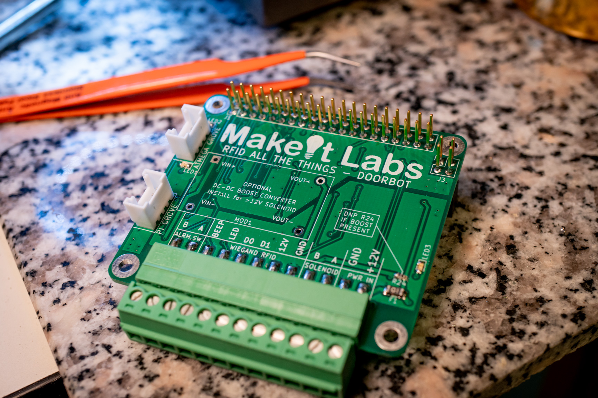
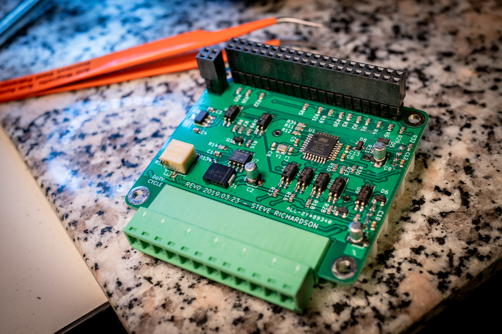
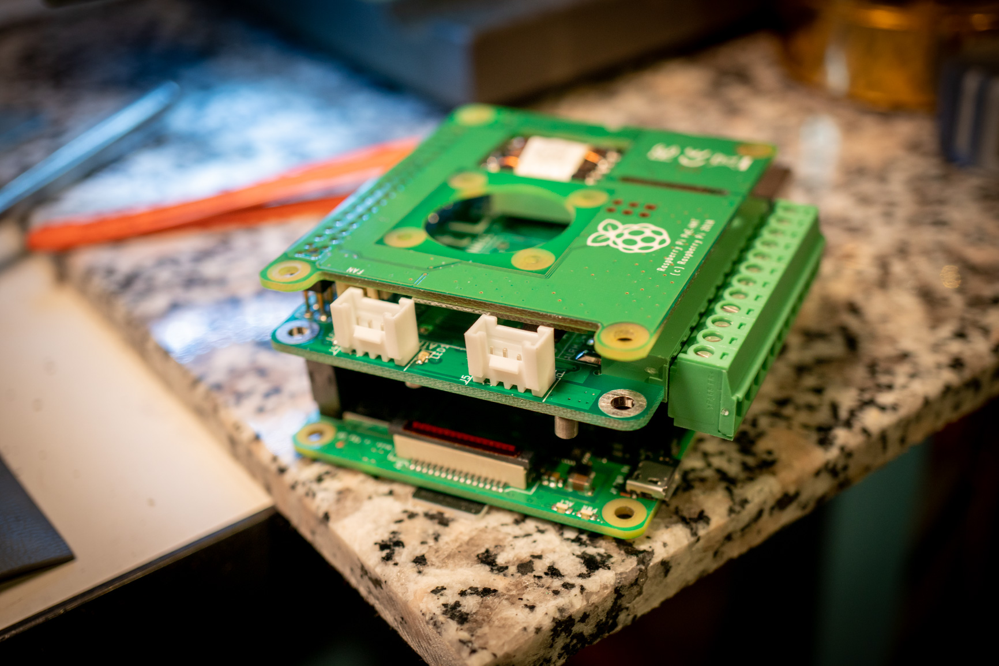

# Doorbot Hardware

  

- `pi_hat` - Access control hat that sandwiches between a Raspberry Pi 3b+ and a Raspberry Pi PoE hat.  It provides isolated Wiegand RFID reader translation as well as isolated PWM solenoid control.
- `i2c_lcd` - Presently incomplete project for an I2C add-on display for the Doorbot Pi hat.
